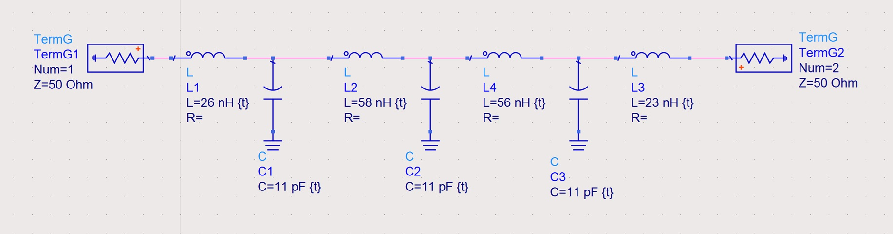
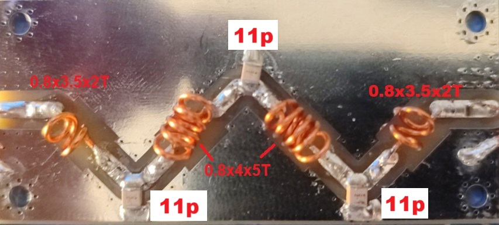

# Low pass filter board

This repo consists of a board for making a low pass filter (LPF). 


You can use it with your own coils and RF capacitors for your desired frequency.

You can use a metal box like [this one](https://www.aliexpress.com/item/1005001849603652.html) of size 92x38x31mm to store it.


------------------------

In order to make it work on satcom frequencies you will need:

```
3x 12pF RF capacitors (https://www.aliexpress.com/item/1005004212044952.html)
0.8mm enameled copper wire

Optional: Storage box (https://www.aliexpress.com/item/1005001849603652.html)
```

**You can also use 11pF capacitors if you want to reduce the S11 logmag but the attenuation at 600mhz will be lower**

Schema:





Side coils instructions:  

```
0.8mm enameled wire, 3.5mm diameter, 2 turns spreaded
```

Middle coils instructions:  

```
0.8mm enameled wire, 4mm diameter, 5 turns spreaded
```

After adjusting with the nanovna you should be able to get this graph:


------------------------

## Ordering the PCB:

Download the Gerber file from this repo and order it a jlcpcb with the default options.  
The only option I've changed is to remove the manufacture code mark


#### Please make sure to visit the [satcom radio website](https://satcomradio.github.io/) for more information